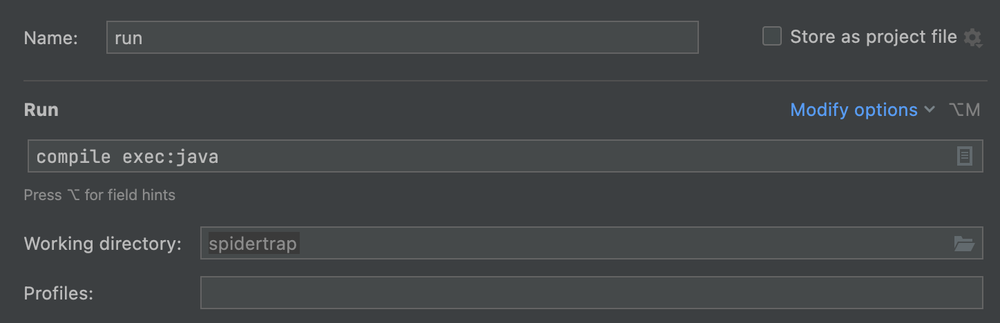

# SpiderTrap

Rising from the playa landscape is the larger-than-life Spider Trap. With its long spindly steel legs, 
Spider Trap stands towering, but not menacing. Spider Trap is constructed primarily of steel tube 
sections that are bolted together with four legs providing the structural stability of the piece and the 
other four holding up the parallel set of webs. The top web will contain hundreds of leds with sensors 
and buttons to allow the occupants of the web hammock below to control the lighting. The steel will be 
painted gray, the web rope hammock will be thick off-white rope, and the lighted led web will be mounted 
to light gauge rolled square steel tube for rigidity. The surrealist scale of this piece invites participants 
to surrender to being "trapped" in the web, relaxing and spending a long moment to explore the art and just get 
lost in the moment.

# Installation Guide
Windows 10 / Mac OS X / Linux
1. Get latest Maven: https://maven.apache.org/download.cgi
2. Extract Maven Binary directory to User/Documents folder, add the path to Bin folder to the PATH environmental variable In System Properties
3. Get latest IntelliJ Community Edition:https://www.jetbrains.com/idea/download/download-thanks.html?platform=windows&code=IIC 
4. Get JDK 17: https://adoptium.net/
5. JAVA_HOME must be set for maven to compile successfully. For example on Mac OS: tracyscott@TracyM1 % echo $JAVA_HOME
   /Library/Java/JavaVirtualMachines/temurin-17.jdk/Contents/Home
6. For Windows, JAVA_HOME can be set similarly to setting the PATH variable.
7. Add the path to Adoptium Java 17 bin folder to the PATH environmental variable In System Properties

8. Get GitHub Desktop: https://central.github.com/deployments/desktop/desktop/latest/win32
9. Clone the project Github Directory to a local directory: https://github.com/tracyscott/SpiderTrap/
10. In Command Prompt, get to the directory of SpiderTrap Github project and Run below mvn install commands (or run mvn_installs.sh):
11. mvn install:install-file -Dfile=lib/lxstudio-0.4.2-SNAPSHOT-jar-with-dependencies.jar -DgroupId=heronarts -DartifactId=lxstudio -Dversion=0.4.2-SNAPSHOT -Dpackaging=jar
12. mvn install:install-file -Dfile=classpath/core-4.0.1.jar -DgroupId=org.processing -DartifactId=core -Dversion=4.0.1 -Dpackaging=jar
13. mvn install:install-file -Dfile=classpath/jogl-all-4.0.1.jar -DgroupId=org.jogamp -DartifactId=jogl-all -Dversion=4.0.1 -Dpackaging=jar
14. mvn install:install-file -Dfile=classpath/gluegen-rt-4.0.1.jar -DgroupId=org.jogamp -DartifactId=gluegen-rt -Dversion=4.0.1 -Dpackaging=jar
15. Processing 4 and JOGL have some native library issues.  We need to explicitly pass -Djava.library.path=natives when running our executable where natives is symlinked to the appropriate classpath/*architecture* directory
16. mkdir natives
17. Mac OS Apple Silicon: cp classpath/macos-aarch64/* natives
18. Mac OS Intel: cp classpath/macos-x86_64/* natives
19. Windows: copy classpath\windows-amd64\* natives
20. mvn package
21. To run from the command line: java -Djava.library.path=natives -jar target/spidertrap-0.4.2-jar-with-dependencies.jar
22. Create a new project in IntelliJ using the pom.xml file in the project directory
23. In the newly created IntelliJ project create a maven run config. Enter 'compile exec:java' for the 'Run' field and in Java Options: VM Options add -Djava.library.path=/Absolute/path/SpiderTrap/natives -Dexec.mainClass=art.lookingup.spidertrap.SpiderTrapApp in Commannd Line field (needs to be tested for new native library issues)

24. Add an IntelliJ run configuration for generating the maven package. Create another Maven configuration and for the command just enter 'package'.
25. Add an IntelliJ run configuration for running the application jar.  Replace any referenced absolute path here with the equivalent on your system. Make sure to have a top-level element selected on the left and then click on '+'.  Choose Jar Application.  Select the target/spidertrap-0.4.2-jar-with-dependencies.jar as the application jar.  For VM options enter: -Djava.library.path=/Users/tracyscott/Documents/GitHub/SpiderTrap/natives

26. For running on a Pixlite, get latest Advatek Assistant: https://www.advateklights.com/downloads/advatek-assistant/windows/V2.3.24

